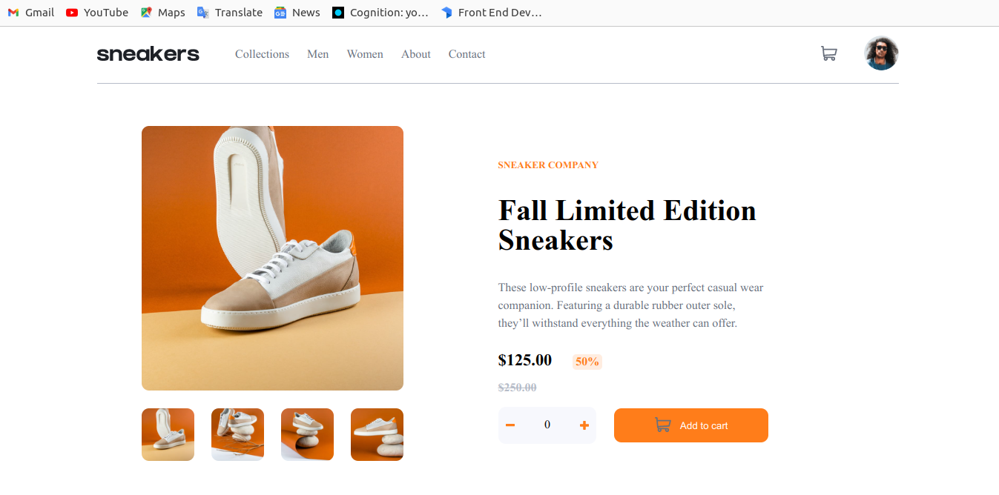
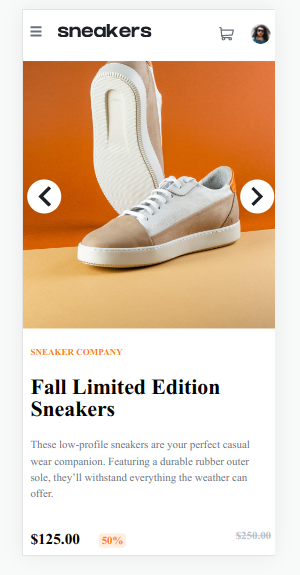
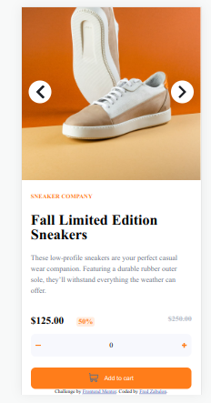

## Table of contents

- [Overview](#overview)
  - [The challenge](#the-challenge)
  - [Screenshot](#screenshot)
  - [Links](#links)
- [My process](#my-process)
  - [Built with](#built-with)
  - [What I learned](#what-i-learned)
  - [Continued development](#continued-development)
- [Author](#author)

## Overview
This is a solution to the [E-commerce product page challenge on Frontend Mentor](https://www.frontendmentor.io/challenges/ecommerce-product-page-UPsZ9MJp6). It was challenging and interesting though at somepoint i failed to avoid duplicate codes. 

### The challenge

Users should be able to:

- View the optimal layout for the site depending on their device's screen size
- See hover states for all interactive elements on the page
- Open a lightbox gallery by clicking on the large product image
- Switch the large product image by clicking on the small thumbnail images
- Add items to the cart
- View the cart and remove items from it

### Screenshot





### Links

- Solution URL: [Add solution URL here](https://your-solution-url.com)
- Live Site URL: [Add live site URL here](https://your-live-site-url.com)

## My process
- i started by finding out ways i can come up with the solution to challege.
- i used the desktop first flow to comeup with the solution.
### Built with

- Semantic HTML5 markup
- CSS custom properties
- Flexbox
- CSS Grid
- desktop-first workflow

### What I learned

I learnt on how to use css variables  and also got to understand that desktop first flow is quiet hectic compared to mobile first workflow.

```css
:root{
  font-size: 16px;  
--mg-lt:1.5rem;  
--ftw-1:400;
--ftw-2:700;  
--primary-clr-1:hsl(26, 100%, 55%);
--primary-clr-2:hsl(25, 100%, 94%);
--text-clr-1:hsl(220, 13%, 13%);
--text-clr-2:hsl(219, 9%, 45%);
--text-clr-3: hsl(220, 14%, 75%);
--bg-clr:hsl(223, 64%, 98%);
--wht-clr:hsl(0, 0%, 100%);
--lt-box-bg:hsl(0, 0%, 75%);
--transit: all 400ms ease;

}

body{
    background-color: var(--wht-clr);
}
```


### Continued development

- responsive design including responsive images.
- animations

## Author

- Frontend Mentor - [Fred Zabulon](https://www.frontendmentor.io/profile/fredzabu)
- Twitter - [Fred Zabulon](https://www.twitter.com/Asiimwefred20)
